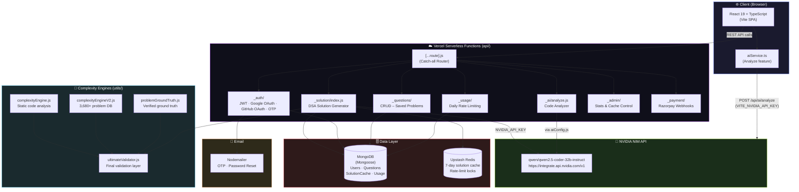

<div align="center">
  
  <br/><br/>
  <p><strong>AI-powered DSA Solution Generator & Revision Tracker</strong></p>
  <p>
    
    
    
    
    
    
  </p>
</div>

---

## Features

🚀 **AI-Powered Solution Generation**

- Get brute force, better, and optimal solutions for any DSA problem
- Powered by **NVIDIA NIM** (`qwen/qwen2.5-coder-32b-instruct`) with multi-tier caching (Redis → MongoDB)
- Supports multiple programming languages (Python, Java, C++, JavaScript and more)

📚 **Smart Revision Tracking**

- Save and organise your solved problems
- Track patterns, categories, and complexity
- Auto-generated revision notes from your own code

🔐 **Secure Authentication**

- Email verification with OTP
- Google & GitHub OAuth
- JWT-based session management with password reset

💳 **Freemium Subscription**

- Free tier with daily usage limits
- Pro plan with expanded limits via Razorpay

📊 **Admin Dashboard**

- User analytics and cache statistics
- Manual cache invalidation
- Usage monitoring per user

---

<details>
<summary><strong>🗺️ Architecture Diagram</strong> — click to expand</summary>

<br/>



### Data Flow: Get Solution

```
User Request
     │
     ▼
Variant Cache? ──(Redis HIT)──────────────────────────────► Return cached
     │ MISS
     ▼
Base Cache? ────(Redis HIT)──────────────────────────────► Return cached
     │ MISS
     ▼
MongoDB Cache? ─(Mongo HIT)──────────────────────────────► Return cached
     │ MISS
     ▼
Fuzzy Name Match? ─(Match + cache found)─────────────────► Return cached
     │ No match / dev mode
     ▼
Daily Limit Check? ─(Limit exceeded)─────────────────────► 429 Error
     │ OK
     ▼
NVIDIA NIM API ─────────────────────────────────────────► JSON Solution
     │
     ▼
Complexity Validation Stack
  ├─ Ground Truth DB (problemGroundTruth.js)
  ├─ V2 Engine (complexityEngineV2.js)
  ├─ Static Analyzer (complexityEngine.js)
  └─ Ultimate Validator (ultimateValidator.js)
     │
     ▼
Safe-to-Show Gate ─────────────────────────────────────► Final Response
     │
     ▼
Save to Redis + MongoDB caches
```

</details>

---

## Tech Stack

| Layer        | Technology                                      |
| ------------ | ----------------------------------------------- |
| **Frontend** | React 19, TypeScript, Vite, TailwindCSS         |
| **Backend**  | Vercel Serverless Functions (Node.js)           |
| **AI**       | NVIDIA NIM — `qwen/qwen2.5-coder-32b-instruct`  |
| **Database** | MongoDB + Mongoose                              |
| **Cache**    | Upstash Redis                                   |
| **Auth**     | JWT, Google OAuth, GitHub OAuth, Nodemailer OTP |
| **Payments** | Razorpay                                        |

---

## Getting Started

### Prerequisites

- Node.js 18+
- MongoDB database
- NVIDIA NIM API key — [Get one free at build.nvidia.com](https://build.nvidia.com)
- Upstash Redis (optional, for faster caching)

### Installation

1. **Clone the repository**

   ```bash
   git clone https://github.com/WillyEverGreen/ReCode.git
   cd ReCode
   ```

2. **Install dependencies**

   ```bash
   npm install
   ```

3. **Configure environment variables**

   ```bash
   cp .env.example .env
   ```

   Fill in your `.env`:

   ```env
   MONGO_URI=mongodb+srv://...
   JWT_SECRET=your-secret-key-min-32-chars

   # NVIDIA NIM (required)
   NVIDIA_API_KEY=nvapi-xxxxxxxxxxxx
   VITE_NVIDIA_API_KEY=nvapi-xxxxxxxxxxxx

   ADMIN_PASSWORD=your-admin-password
   ```

4. **Run development server**

   ```bash
   # Recommended — tests serverless functions locally
   vercel dev

   # Or Vite + Express separately
   npm run server   # Express API on port 5000
   npm run dev      # Vite frontend on port 3000
   ```

5. **Open http://localhost:3000**

---

## Deployment

### Vercel (Recommended)

1. Push code to GitHub
2. Import project at [vercel.com](https://vercel.com)
3. Add environment variables in the Vercel dashboard
4. Deploy

### Required Environment Variables

| Variable                   | Required | Description                           |
| -------------------------- | -------- | ------------------------------------- |
| `MONGO_URI`                | ✓        | MongoDB connection string             |
| `JWT_SECRET`               | ✓        | Secret for JWT tokens (min 32 chars)  |
| `NVIDIA_API_KEY`           | ✓        | NVIDIA NIM API key (backend)          |
| `VITE_NVIDIA_API_KEY`      | ✓        | NVIDIA NIM API key (frontend analyze) |
| `ADMIN_PASSWORD`           | ✓        | Admin panel password                  |
| `UPSTASH_REDIS_REST_URL`   |          | Upstash Redis URL                     |
| `UPSTASH_REDIS_REST_TOKEN` |          | Upstash Redis token                   |
| `NVIDIA_MODEL`             |          | Override default AI model             |

---

## API Endpoints

| Endpoint                    | Method   | Description            |
| --------------------------- | -------- | ---------------------- |
| `/api/health`               | GET      | Health check           |
| `/api/auth/signup`          | POST     | User registration      |
| `/api/auth/login`           | POST     | User login             |
| `/api/auth/verify-email`    | POST     | Verify email OTP       |
| `/api/auth/forgot-password` | POST     | Request password reset |
| `/api/auth/reset-password`  | POST     | Reset password         |
| `/api/solution`             | POST     | Generate DSA solution  |
| `/api/ai/analyze`           | POST     | Analyze user code      |
| `/api/questions`            | GET/POST | User's saved questions |
| `/api/usage`                | GET      | Check daily usage      |
| `/api/admin/stats`          | GET      | Admin statistics       |

---

## Project Structure

```
ReCode/
├── api/                        # Vercel Serverless Functions
│   ├── _lib/                   # Shared utilities
│   │   ├── aiConfig.js         # NVIDIA NIM configuration
│   │   ├── auth.js             # JWT helpers + CORS
│   │   ├── mongodb.js          # DB connection
│   │   ├── email.js            # Nodemailer setup
│   │   └── userId.js           # User ID resolution
│   ├── _ai/analyze.js          # Code analysis endpoint
│   ├── _auth/                  # Auth routes (JWT, Google, GitHub, OTP)
│   ├── _admin/                 # Admin endpoints
│   ├── _payment/               # Razorpay webhooks
│   ├── _questions/             # Questions CRUD
│   ├── _solution/index.js      # DSA solution generator (NVIDIA NIM)
│   ├── _usage/                 # Usage tracking & rate limiting
│   └── [...route].js           # Catch-all router
├── components/                 # React components
│   └── Auth/                   # Authentication UI
├── models/                     # MongoDB models
│   ├── User.js
│   ├── Question.js
│   ├── SolutionCache.js
│   ├── UserUsage.js
│   └── Otp.js
├── services/
│   └── aiService.ts            # Frontend AI service (NVIDIA NIM)
├── utils/                      # Complexity validation engines
│   ├── complexityEngine.js
│   ├── complexityEngineV2.js
│   ├── problemGroundTruth.js
│   ├── ultimateValidator.js
│   └── ...
├── scripts/                    # Dev/admin utility scripts
│   ├── test-nvidia.js          # Test NVIDIA API connectivity
│   └── ...
├── types.ts                    # TypeScript type definitions
└── vercel.json                 # Vercel routing config
```

---

## Contributing

1. Fork the repository
2. Create your feature branch (`git checkout -b feature/AmazingFeature`)
3. Commit your changes (`git commit -m 'Add some AmazingFeature'`)
4. Push to the branch (`git push origin feature/AmazingFeature`)
5. Open a Pull Request

## License

This project is licensed under the MIT License.

---

<div align="center">
  Made with ❤️ by <a href="https://github.com/WillyEverGreen">WillyEverGreen</a>
</div>
