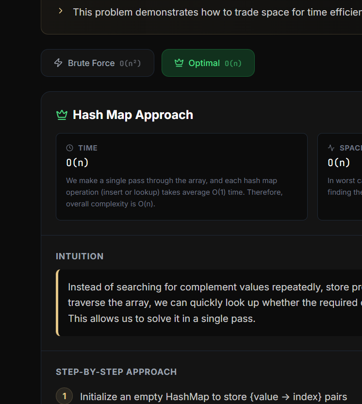
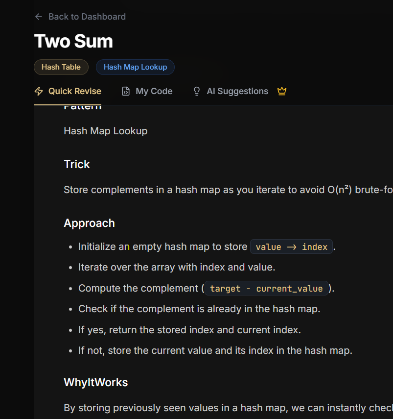
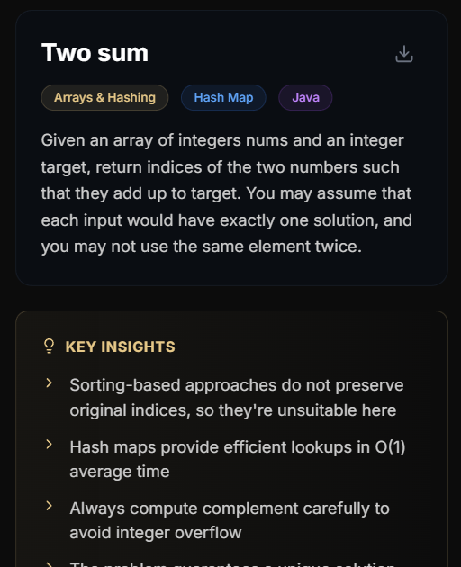
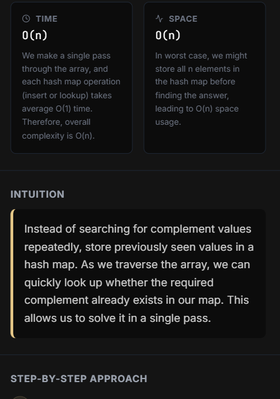
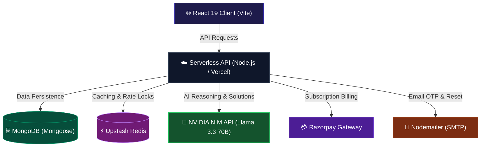

<div align="center">
  
  <br/><br/>
  <p><strong>Transform your raw DSA submissions into beautifully structured, exam-ready revision cards and code portfolios.</strong></p>
  <p>
    
    
    
    
    
  </p>
</div>

---

## ✨ Screenshots & UI Preview

<details>
<summary><strong>📸 Desktop & Mobile App Previews</strong> — click to expand</summary>

<br/>

### 🖥️ Desktop Dashboard & Revision Hub

_View and search your solved problems, track progression tiers, and access AI-generated solutions._


### 📊 Deep Analysis Panel

_Visualize space/time complexity metrics, step-by-step logic breakdown, edge cases, and code improvement suggestions._


### 📱 Premium Mobile Experience

_Practice, review, and track your revision on the go with a fully responsive layout._

<p align="center">
  
  
</p>

</details>

---

## 🚀 Key Features

- **AI-Powered Solution Generator**: Instantly generates **Brute Force**, **Better**, and **Optimal** solutions with clean, compilable, and inline-commented code. Powered by **NVIDIA NIM** (`meta/llama-3.3-70b-instruct`).
- **Smart Revision Tracking**: Save your solved problems, categorize them by primary DSA patterns, and generate spaced-repetition revision notes automatically.
- **Dual Caching System**: Integrates **Upstash Redis** (for lightning-fast variant and base caching) and **MongoDB** (for persistent storage and recovery), minimizing API costs.
- **Complexity Validation Stack**: Features an advanced validation pipeline that checks AI time/space complexities against a database of **3,680+ verified LeetCode problems** to guarantee accuracy.
- **Secure Authentication**: Includes Email OTP verification, Google OAuth, GitHub OAuth, and session management using JWT.
- **Freemium & Payment Integration**: Daily usage rate limits for free tier, upgradeable to Pro using **Razorpay** payments.
- **Admin Control Center**: Built-in panel for cache invalidation, user usage analytics, and MongoDB status tracking.

---

## 🗺️ Architecture & Data Flow

<details>
<summary><strong>⚙️ System Architecture</strong> — click to expand</summary>

<br/>



### Data Flow: Get Solution

```
[Client Request] ──► [Check Redis / MongoDB Cache] ──► [Cache Hit: Return Solution]
                               │ Cache Miss
                               ▼
                        [NVIDIA NIM API] ──► [Save to Cache & Return]
```

</details>

---

## 🛠️ Technology Stack

| Layer           | Technology                                 | Description                                    |
| --------------- | ------------------------------------------ | ---------------------------------------------- |
| **Frontend**    | React 19, TypeScript, Vite, TailwindCSS    | High-performance user interface                |
| **Backend**     | Vercel Serverless Functions (Node.js)      | Serverless API routes                          |
| **AI Engine**   | NVIDIA NIM (`meta/llama-3.3-70b-instruct`) | Context-aware code generation & logic analysis |
| **Database**    | MongoDB + Mongoose                         | Persistent revision storage & base caching     |
| **Cache Layer** | Upstash Redis                              | Fast, distributed, low-latency temporary cache |
| **Email**       | Nodemailer                                 | Password resets & OTP codes                    |
| **Payments**    | Razorpay                                   | Subscription order creation and webhooks       |

---

## 📦 Getting Started

### Prerequisites

- Node.js (v18+)
- MongoDB Instance (Atlas or Local)
- NVIDIA NIM API Key (Sign up at [build.nvidia.com](https://build.nvidia.com))
- Upstash Redis (Optional)

### Installation

1. **Clone the repo:**

   ```bash
   git clone https://github.com/WillyEverGreen/ReCode.git
   cd ReCode
   ```

2. **Install dependencies:**

   ```bash
   npm install
   ```

3. **Configure the environment:**
   Create a `.env` file in the root based on `.env.example`:

   ```bash
   cp .env.example .env
   ```

   Add your keys:

   ```env
   MONGO_URI=mongodb://127.0.0.1:27017/recode
   JWT_SECRET=your_jwt_secret_at_least_32_characters
   NVIDIA_API_KEY=nvapi-xxxxxx
   VITE_NVIDIA_API_KEY=nvapi-xxxxxx
   ```

4. **Launch the development environments:**
   - **Recommended (tests serverless API + client simultaneously):**
     ```bash
     npm install -g vercel
     vercel dev
     ```
   - **Alternative (launches server and client independently):**
     ```bash
     npm run server   # Node Express server on port 5000
     npm run dev      # Vite Dev server on port 3000
     ```

5. Open [http://localhost:3000](http://localhost:3000) in your browser.

---

## ⚙️ Environment Configuration

| Variable                   | Type     | Description                                                    |
| -------------------------- | -------- | -------------------------------------------------------------- |
| `MONGO_URI`                | Required | Connection string for MongoDB                                  |
| `JWT_SECRET`               | Required | Used for token encryption (min 32 chars)                       |
| `NVIDIA_API_KEY`           | Required | Backend API key for NIM completion                             |
| `VITE_NVIDIA_API_KEY`      | Required | Frontend API key for browser-based code analysis               |
| `ADMIN_PASSWORD`           | Required | Admin dashboard credentials                                    |
| `UPSTASH_REDIS_REST_URL`   | Optional | Upstash Redis connection endpoint                              |
| `UPSTASH_REDIS_REST_TOKEN` | Optional | Upstash Redis connection token                                 |
| `NVIDIA_MODEL`             | Optional | Override NIM model (defaults to `meta/llama-3.3-70b-instruct`) |

---

## 📝 API Endpoints

| Endpoint                 | Method       | Authentication | Description                               |
| ------------------------ | ------------ | -------------- | ----------------------------------------- |
| `/api/health`            | `GET`        | Public         | System status check                       |
| `/api/auth/signup`       | `POST`       | Public         | Registers a new account                   |
| `/api/auth/login`        | `POST`       | Public         | Authenticates and returns JWT             |
| `/api/auth/verify-email` | `POST`       | Public         | Verifies account via Nodemailer OTP       |
| `/api/solution`          | `POST`       | User JWT       | Generates the 3-approach code solution    |
| `/api/ai/analyze`        | `POST`       | User JWT       | Analyzes code complexity and structure    |
| `/api/questions`         | `GET`/`POST` | User JWT       | Reads/writes saved user questions         |
| `/api/usage`             | `GET`        | User JWT       | Returns remaining daily rate limits       |
| `/api/admin/stats`       | `GET`        | Admin Pass     | Displays global analytics and cache rates |

---

<div align="center">
  Made with ❤️ by <a href="https://github.com/WillyEverGreen">WillyEverGreen</a>
</div>
